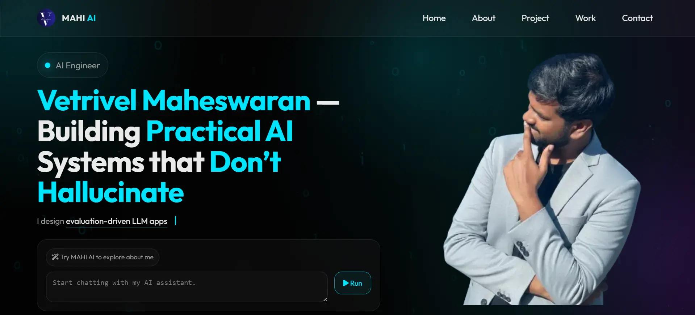

# Vetrivel Maheswaran – Portfolio Website with AI Chatbot

This project is a **personal portfolio website** built primarily as a **static front-end** (HTML, CSS, JavaScript) and enhanced with a **Flask-based AI chatbot service**.  

The site presents professional information such as background, projects, experience, and contact details. The chatbot is added to **demonstrate practical LLM integration** and provide an interactive way for visitors to explore the portfolio content.

Although the website pages are static, the application runs as a **web service** to support the chatbot API.

---

## 📌 Features
- Multi-page static portfolio (`Home`, `About`, `Projects`, `Work`, `Contact`)
- Responsive UI with modern visual effects
- Interactive AI chatbot embedded in the homepage
- Chat drawer UI with typing indicator and message alignment
- Clickable navigation links generated dynamically from chat responses
- Production deployment using Gunicorn

---

## 🤖 Chatbot
The chatbot is an **AI-powered portfolio assistant** built using Flask and OpenAI’s `GPT-4o` model.

Key characteristics:
- Uses a **curated, static knowledge base** describing portfolio content
- Responses are **prompt-grounded** to avoid hallucination
- Frontend auto-links navigation phrases (e.g., “Contact Page”, “Projects Page”)
- Typing indicator (`...`) shown while responses are generated
- Clean message layout (user on right, assistant on left)

The chatbot is designed to **guide visitors through the portfolio**, not to act as a general-purpose AI assistant.

---

## 🛠️ Tech Stack

| Component | Technology |
| --- | --- |
| **Frontend** | `HTML`, `CSS`, `JS` |
| **Backend** | `Python (Flask)` |
| **LLM** | `GPT-4o` |
| **Server** | `Gunicorn` |
| **Deployment** | `Render` |

---

## 📸 Preview

---

## 🔔 Bells & Whistles

- Smooth transitions and glass-morphism UI effects
- Auto-scrolling chat window
- Responsive chat layout
- Frontend-controlled navigation linking
- Production-safe configuration

---

## Author

👤 **[Vetrivel Maheswaran](https://github.com/Vetrivel07)**

## Connect With Me 🌐

****

****

<b>© Created by Vetrivel Maheswaran</b>

